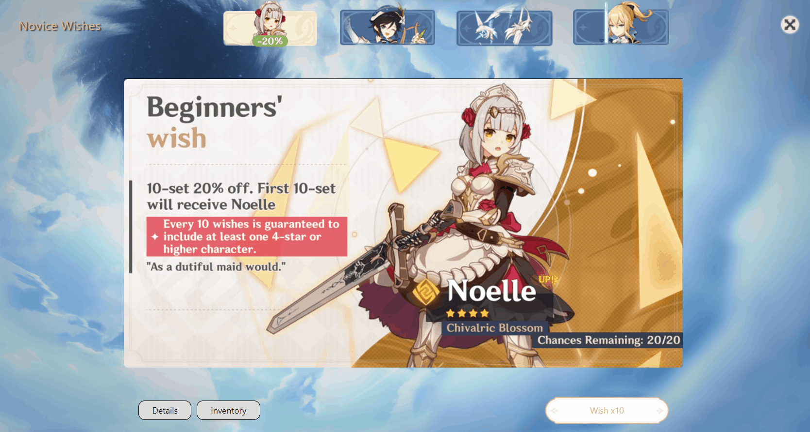

# Genshin Impact Wish Simulator
A React web application to simulate Genshin Impact gacha in the browser

## Disclaimer

<p>
  This Genshin Impact Wish Simulator was only created for fun and absolutely no monetary gain.
</p>
<p>
  I am someone who enjoys playing Genshin Impact and enjoys building applications for fun.
  I am not affiliated with Mihoyo, all assets in this application were taken from third party websites and some screenshotted from the game itself.
</p>
<p>
  If you are someone from Mihoyo and would like the website taken down please email me <a href="mailto:uzinatorcl@gmail.com">here</a> and I shall do so.
</p>
<p>
  Pls don't get me in trouble this was just for fun T_T
</p>
<p>
  All product names, logos, and brands are property of their respective owners in the United States and/or other countries.
</p>

#### Special Thanks

Thank you to all the supporters on Reddit, everyone's kind words mean a lot and the feedback has been awesome.

Thank you to [lauslim12](https://github.com/lauslim12), your contributions have been an amazing help.

Thanks to the following redditors who sent me their 5 Star animation videos.

- /u/ShiroYashaa
- /u/a_truly_masterpiece

## Technologies Used
- React
- Webpack
- Babel
- Bootstrap 4
- Mocha
- Chai

## Live Demo

Try the application live at [https://gi-wish-simulator.uzairashraf.dev/](https://gi-wish-simulator.uzairashraf.dev/)

## Preview

- Banners
  <p align="center">
    
  </p>

- Details
  <p align="center">
    
  </p>

- Wish
  <p align="center">
    
  </p>

- Inventory
  <p align="center">
    
  </p>

## Features

- User can wish
- User can view banners
- User can switch banners
- User can preserve the banner they wished for
- User can view inventory
- User can reset inventory
- User can filter between characters, weapons, and ratings in inventory
- User can see estimated money spent in USD
- User can see wish animation before seeing pulls
- User can see both 4 and 5 star animation for pulls
- User can skip animation
- User's inventory and attempts persists in local storage
- User won't sue me (pls)

## Development

#### System Requirements

- NPM 6 or higher

#### Getting Started

1. Clone the repository.

    ```shell
    git clone https://github.com/uzair-ashraf/genshin-impact-wish-simulator.git
    cd genshin-impact-wish-simulator
    ```

1. Install all dependencies with NPM.

    ```shell
    npm install
    ```

1. Confirm all banners are working appropriately

    ```shell
    npm run test
    ```

1. Run the webpack development server.

    ```shell
    npm run dev
    ```

1. Once started you can view the application by opening http://localhost:3000 in your browser.

#### Testing

1. Any banner added or modified will need to have test coverage.  See `test/test.js` file for test suite.

1. Run tests

    ```shell
    npm run test
    ```

#### Contributing

I am welcome to all contributors! Please open an issue when a problem is found and feel free to open a pull request.
